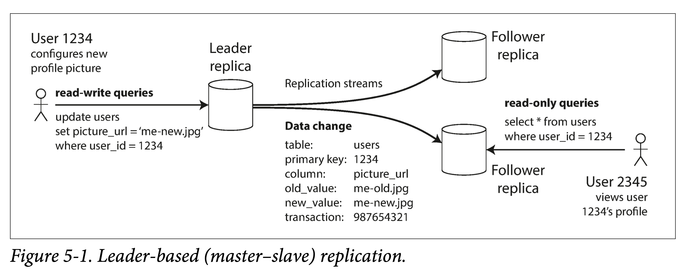
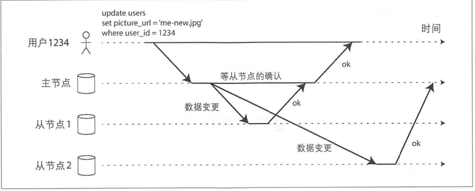

# 数据复制

> 复制主要指通过互联网络在多台机器上保存相同数据的副本

- 使数据在地理位置上更接近用户，从而降低访问延迟。
- 当部分组件出现位障，系统依然可以继续工作，从而提高可用性。
- 扩展至多台机器以同时提供数据访问服务，从而提高读吞吐量。

如果数据是**只读**的，则复制很好做，直接复制到多机即可。我们有时可以利用这个特性，使用分治策略，将数据分为只读部分和读写部分，则只读部分的冗余就会容易处理的多，甚至可以用 [EC](https://zh.wikipedia.org/wiki/纠错码) 方式做冗余，减小存储放大的同时，还提高了可用性。

论三种流行的复制数据变化的方法

1. 主从复制

2. 多主节点复制

3. 主节点复制

## 主节点与从节点

1. 指定某一个副本为主副本 （或称为主节点）。当客户写数据库时，必须将写请求首先发送给主副本，主副本首先将新数据写入本地存储。

2. 其他副本则全部称为从副本（或称为从节点）。主副本把新数据写入本地存储后，然后将数据更改作为复制的日志或更改流发送给所有从副本。每个从副本获得更改日志之后将其应用到本地，且严格保持与主副本相同的写入顺序。

3. 客户端从数据库中读数据 ，可以在主副本或者从副本上执行查询。再次强调，只有主副本才可以接受写请求 ：从客户端的角度来看，从副本都是只读的。

## 同步复制与异步复制

